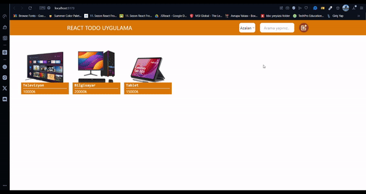

# Ürün Yönetim Sistemi

Bu proje, React Redux Toolkit kullanılarak ürün ekleme, listeleme, güncelleme, silme, arama ve sıralama özelliklerine sahip basit bir ürün yönetim sistemidir. Kullanıcılar ürün ekleyebilir, eklenen ürünleri görüntüleyebilir, güncelleyebilir ve silebilirler. Ayrıca, ürün isimlerine göre arama yapabilir ve ürünleri sıralayabilirler.

## Özellikler

- **Ürün Ekleme:** Yeni ürün ekleyebilme.
- **Ürün Listeleme:** Eklenen ürünlerin listelenmesi.
- **Ürün Güncelleme:** Üzerindeki güncelleme butonları ile ürün bilgilerini düzenleyebilme.
- **Ürün Silme:** Ürünleri listeden kaldırabilme.
- **Ürün Arama:** Ürün isimlerine göre arama yapabilme.
- **Sıralama:** Ürünleri belirli kriterlere göre sıralayabilme.

## Proje Kurulumu

Projeyi yerel ortamınızda çalıştırmak için aşağıdaki adımları izleyin:

1. Projeyi klonlayın:

   ```bash
   git clone https://github.com/cengo14/react-redux-crud-project.git
   ```

2. Proje dizinine gidin:

   ```bash
   cd react-redux-crud-project
   ```

3. Gerekli bağımlılıkları yükleyin:

   ```bash
   npm install
   ```

4. Projeyi başlatın:

   ```bash
   npm run dev
   ```

## Kullanılan Teknolojiler

- **React** - UI oluşturmak için
- **Redux Toolkit** - Durum yönetimi için
- **React Redux** - Durum yönetimi için
- **React Icons** - Durum yönetimi için
- **Tailwind** - Stil düzenlemeleri için
- **React Router DOM** - Çoklu sayfa navigasyonu (opsiyonel)

## Ekran Görüntüleri

Ürün ekleme, listeleme, güncelleme ve silme işlemlerini gösteren ekran görüntüleri:

### Ana Sayfa



## Katkıda Bulunma

Katkıda bulunmak isterseniz, pull request açabilir veya issue oluşturabilirsiniz.

